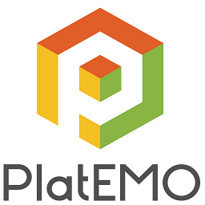

  

# PlatEMO
[](https://github.com/BIMK/PlatEMO/archive/master.zip) 
[](https://github.com/BIMK/PlatEMO/releases/)
[](#PlatEMO)  
[](#PlatEMO)
[](#PlatEMO)
[](#PlatEMO)  
Evolutionary multi-objective optimization platform
* 100+ open source evolutionary algorithms
* 120+ open source multi-objective test problems
* Powerful GUI for performing experiments in parallel
* Generating results in the format of Excel or LaTeX table by one-click operation
* State-of-the-art algorithms will be included continuously

Thank you very much for using PlatEMO. The copyright of PlatEMO belongs to the BIMK Group. This
tool is mainly for research and educational purposes. The codes were implemented based on our
understanding of the algorithms published in the papers. You should not rely upon the material or
information on the website as a basis for making any business, legal or any other decisions. We
assume no responsibilities for any consequences of your using any algorithms in the tool. All
publications using the platform should acknowledge the use of “PlatEMO” and reference the
following literature:

## Copyright
> The Copyright of the PlatEMO belongs to the BIMK group. You are free to [use the PlatEMO](https://github.com/BIMK/PlatEMO/releases) for **research purposes**. All publications which use this platform or any code in the platform should **acknowledge the use of "PlatEMO" and reference** _"Ye Tian, Ran Cheng, Xingyi Zhang, and Yaochu Jin, PlatEMO: A MATLAB Platform for Evolutionary Multi-Objective Optimization [Educational Forum], IEEE Computational Intelligence Magazine, 2017, 12(4): 73-87"._  

```
@article{PlatEMO,
  title={{PlatEMO}: A {MATLAB} platform for evolutionary multi-objective optimization},
  author={Tian, Ye and Cheng, Ran and Zhang, Xingyi and Jin, Yaochu},
  journal={IEEE Computational Intelligence Magazine},
  volume={12},
  number={4},
  pages={73--87},
  year={2017},
}
```  
# Release Highlights of PlatEMO 2.2  
[Release Note can be found here](./Doc/releasenote.md)

* Add two algorithms AGE-MOEA and PPS.
* Add the constrained benchmark problems DAS-CMOP1-9 and LIR-CMOP1-14.


# Features of PlatEMO
*  Totally Developed in MATLAB  
PlatEMO consists of a number of MATLAB functions without using any other libraries. Any machines able to run MATLAB can use PlatEMO regardless of the operating system.  

*  Includes Many Popular Algorithms  
PlatEMO includes more than ninety existing popular MOEAs, including genetic algorithm, differential evolution, particle swarm optimization, memetic algorithm, estimation of distribution algorithm, and surrogate model based algorithm. Most of them are representative algorithms published in top journals after 2010.  

*  Various Figure Demonstrations  
Users can select various figures to be displayed, including the Pareto front of the result, the Pareto set of the result, the true Pareto front, and the evolutionary trajectories of any performance indicator values.  

*  Powerful and Friendly GUI  
PlatEMO provides a powerful and friendly GUI, where users can configure all the settings and perform experiments in parallel via the GUI without writing any code.  

*  Generates Data in the Format of Excel or LaTeX  
Users can save the statistical experimental results generated by PlatEMO as an Excel table or LaTeX table, which can be directly used in academic writings.  

# Support  
* [**recommend**] You can ask any question in [issues block](https://github.com/BIMK/PlatEMO/issues) and upload your contribution by pulling request(PR).   
* If you want to add your MOEA, MOP, operator or performance indicator to PlatEMO, please send the MATLAB code (able to be used in PlatEMO) and the relevant literature to field910921@gmail.com.  
* If you have any question, comment or suggestion to PlatEMO or the algorithms in PlatEMO, please contact Ye Tian (field910921@gmail.com) or join the group of QQ(Group number: 100065008).    
 
  

# Acknowledge  
This repo belongs to BIMK group and has been transferred project from [BIMK](http://bimk.ahu.edu.cn/) to github by Ye Tian and Shichen Peng[@anonymone](https://github.com/anonymone).